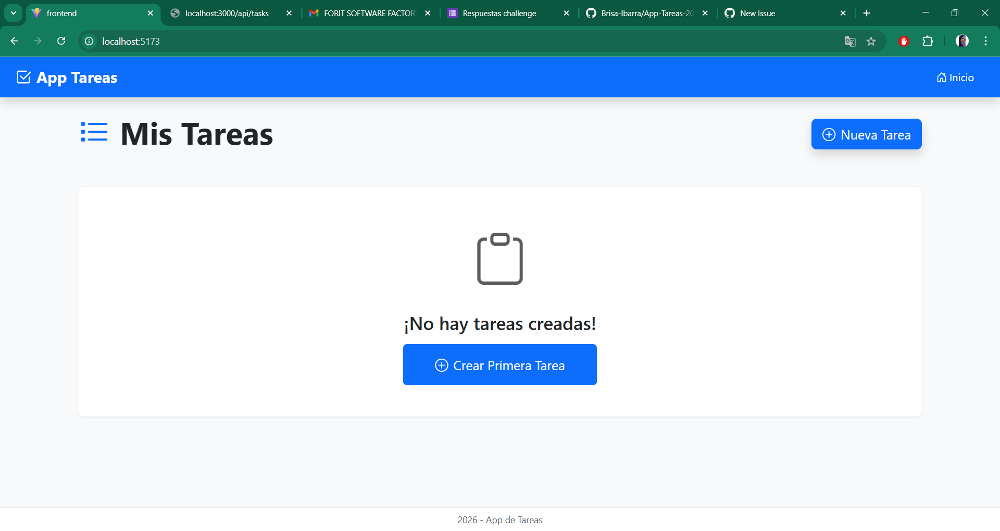
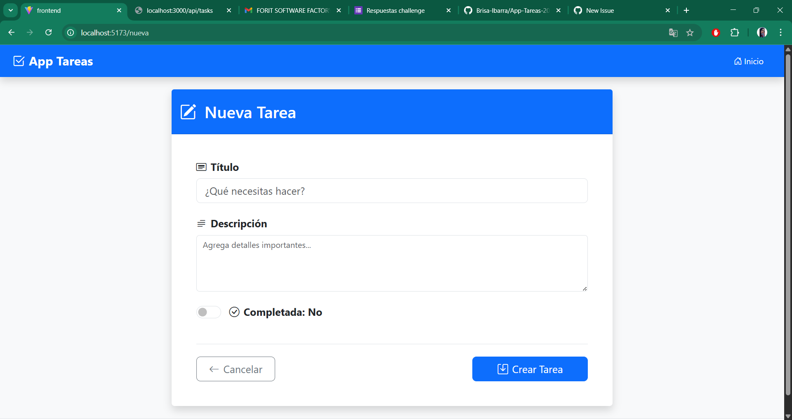
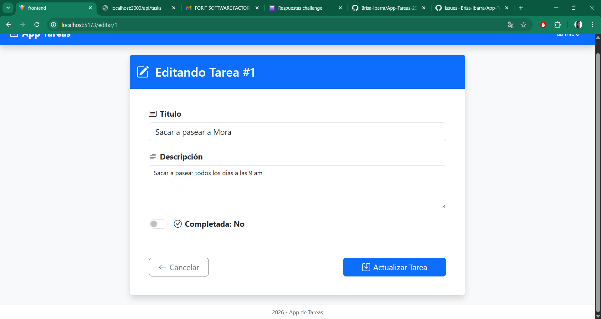
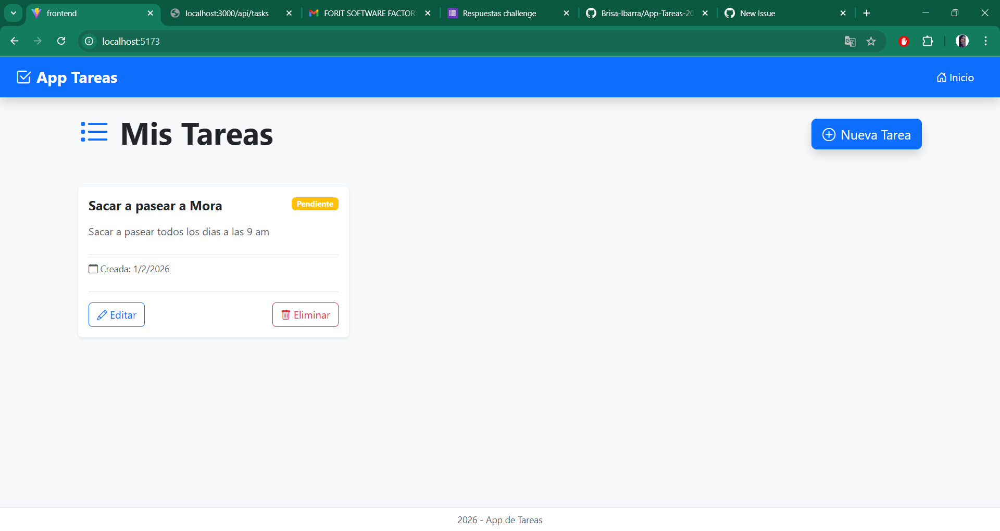

# App de Tareas - ToDo App

Una aplicación web completa para gestión de tareas desarrollada con React (Frontend) y Express (Backend).

## Características

-  Crear nuevas tareas con título y descripción
-  Listar todas las tareas existentes
-  Editar tareas existentes
-  Marcar tareas como completadas
-  Eliminar tareas

## 1. Vista Principal - Lista de Tareas

''' bash
cd backend
npm install
npm run dev
//http://localhost:3000

cd frontend (en otra terminal)
npm install
npm run dev
//http://localhost:5173
